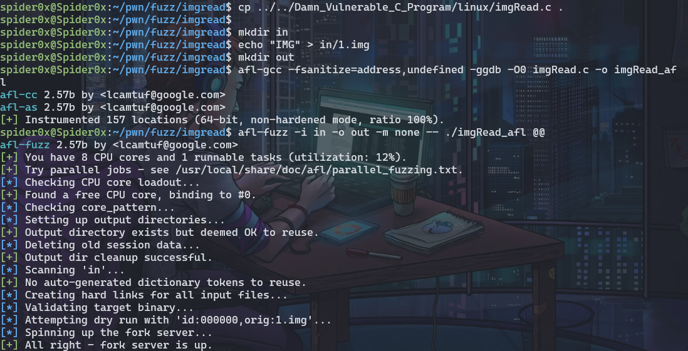
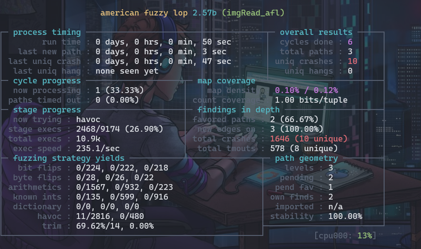

# Overview

Fuzzing is about letting an application try different inputs to find a bug but after that, it's your responsibility to analyze the bug and decide if it's a security issue and can be exploited.

fuzzing is a huge topic and takes too much time in practice so I will start with how to fuzz simple programs and go along with different types of fuzzers and fuzzing open and closed source applications in Linux and Windows.

here is a great [resource](https://fuzzing.in/codelabs/finding_security_vulnerabilities/index.html?index=..%2F..index#0) for you to start.

# AFL Open Source

Here I am going with the [Damn_Vulnerable_C_Program](https://github.com/hardik05/Damn_Vulnerable_C_Program.git
) to start my journey with.

what we did is just compile the code with "AFL" then provide an initial input and launch the application within "AFL" and it will mutate our input and input it again.

then we can find the inputs that lead to crashes in the "out" folder, and the analysis of the root cause may reveal a vulnerability.

this [repository](https://github.com/antonio-morales/Fuzzing101/tree/main) can be a good starting point for hands on experience.

