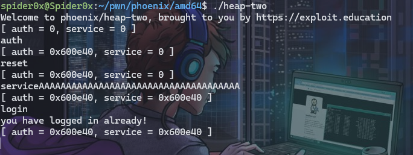

# Overview

Stack overflows were sometimes the most scaring vulnerability, but nowadays heap is the most effective and spread attack vector due to the complexity that is being added to make the dynamic allocator more secure.

you can learn about the security issues related to the heap in [pwn college](https://www.youtube.com/playlist?list=PL-ymxv0nOtqoUdeKoKMxZBlfd9pD3mAah).

# level0

```c
#include <err.h>
#include <stdio.h>
#include <stdlib.h>
#include <string.h>
#include <unistd.h>

#define BANNER \
  "Welcome to " LEVELNAME ", brought to you by https://exploit.education"

struct data {
  char name[64];
};

struct fp {
  void (*fp)();
  char __pad[64 - sizeof(unsigned long)];
};

void winner() {
  printf("Congratulations, you have passed this level\n");
}

void nowinner() {
  printf(
      "level has not been passed - function pointer has not been "
      "overwritten\n");
}

int main(int argc, char **argv) {
  struct data *d;
  struct fp *f;

  printf("%s\n", BANNER);

  if (argc < 2) {
    printf("Please specify an argument to copy :-)\n");
    exit(1);
  }

  d = malloc(sizeof(struct data));
  f = malloc(sizeof(struct fp));
  f->fp = nowinner;

  strcpy(d->name, argv[1]);

  printf("data is at %p, fp is at %p, will be calling %p\n", d, f, f->fp);
  fflush(stdout);

  f->fp();

  return 0;
}
```

The code here is very simple to exploit as the allocations are following each other, in our case there are "0x50" bytes between the two of them so It's easy to overwrite the "fp" pointer with any value.


# level1

```c
#include <stdio.h>
#include <stdlib.h>
#include <string.h>
#include <time.h>
#include <unistd.h>

#define BANNER \
  "Welcome to " LEVELNAME ", brought to you by https://exploit.education"

struct heapStructure {
  int priority;
  char *name;
};

int main(int argc, char **argv) {
  struct heapStructure *i1, *i2;

  i1 = malloc(sizeof(struct heapStructure));
  i1->priority = 1;
  i1->name = malloc(8);

  i2 = malloc(sizeof(struct heapStructure));
  i2->priority = 2;
  i2->name = malloc(8);

  strcpy(i1->name, argv[1]);
  strcpy(i2->name, argv[2]);

  printf("and that's a wrap folks!\n");
}

void winner() {
  printf(
      "Congratulations, you've completed this level @ %ld seconds past the "
      "Epoch\n",
      time(NULL));
}
```

Here we are creating two structures in the stack each is 16 bytes, so let's have a look at what addresses are allocated to each one.


again both of them assigned values following each other with offset 0x50 from the start of each of them, but inside each one, there is another allocation for the "name" field.

just by calculating the offset of the two allocated memory, it's "0x28"

But think a little bit here!! there is now a function pointer to overwrite to redirect the flow to our winner function, so what else we can do??!

that's easy, We can overwrite the second pointer with an address that we need to write to with the value entered first then the second value we entered will be written to that address.

So what about overwriting the "GOT" of the next "puts(printf)" function with our "winner" function address?

the solution here will be like this.
"A"*28 + \PUTsGOT address + winner address

# level2

```c
#include <err.h>
#include <stdio.h>
#include <stdlib.h>
#include <string.h>
#include <unistd.h>

#define BANNER \
  "Welcome to " LEVELNAME ", brought to you by https://exploit.education"

struct auth {
  char name[32];
  int auth;
};

struct auth *auth;
char *service;

int main(int argc, char **argv) {
  char line[128];

  printf("%s\n", BANNER);

  while (1) {
    printf("[ auth = %p, service = %p ]\n", auth, service);

    if (fgets(line, sizeof(line), stdin) == NULL) break;

    if (strncmp(line, "auth ", 5) == 0) {
      auth = malloc(sizeof(struct auth));
      memset(auth, 0, sizeof(struct auth));
      if (strlen(line + 5) < 31) {
        strcpy(auth->name, line + 5);
      }
    }
    if (strncmp(line, "reset", 5) == 0) {
      free(auth);
    }
    if (strncmp(line, "service", 6) == 0) {
      service = strdup(line + 7);
    }
    if (strncmp(line, "login", 5) == 0) {
      if (auth && auth->auth) {
        printf("you have logged in already!\n");
      } else {
        printf("please enter your password\n");
      }
    }
  }
}
```

this challenge demonstrates how the heap works especially the fact that freeing a heap space doesn't affect the pointer value it will be pointing at the same place, so any allocation that will happen on that place will overwrite data pointed to by that freed pointer and this what is called "use after free" when we will use the same freed pointer for authentication.



